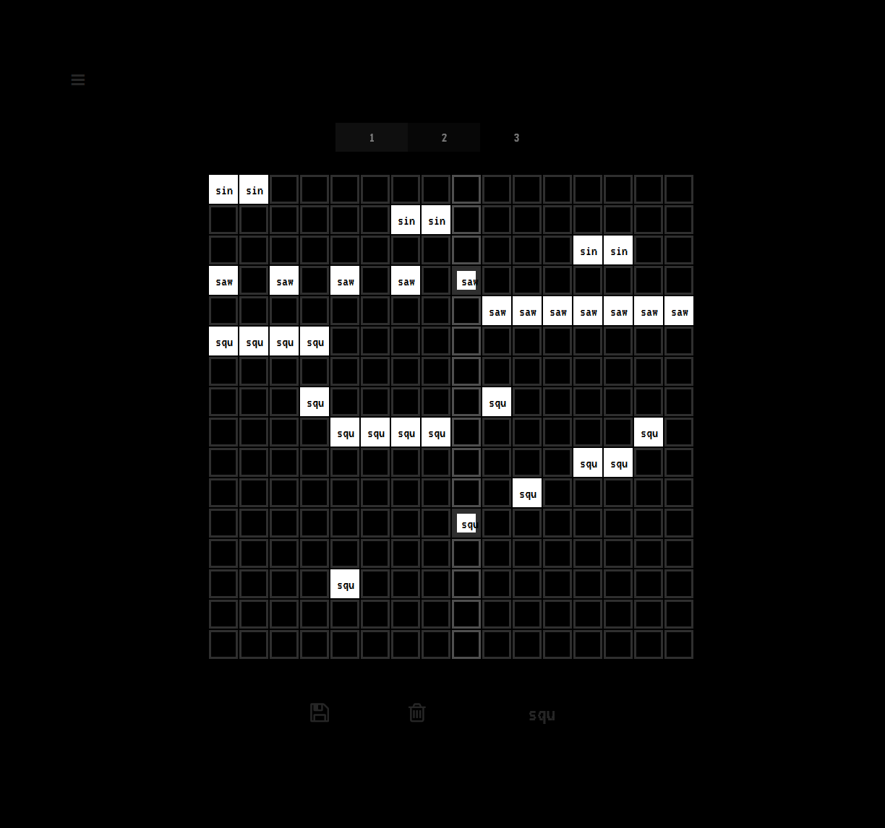

# prgrid

### Development files for *prgrid*, a simple oscillator sound grid.

Top tabs indicate the song bank, left tabs indicate the layer.\
You can cycle through waveforms (*square, sawtooth, sine, triangle*) by clicking .
